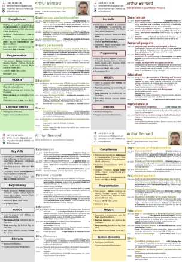

# Customizable template of Cover Letter and CV in LaTeX

## Description

**Customizable CV template**, `arthur-cv`, allow you to choose **color themes**, display or not some personal information (age, address, pictures, etc.) with respect to **English and French convention**, define some sections on left bar (skills, etc.), and define some sections in the body (education, experience, etc.) of the CV.

**Customizable cover letter template**, `arthur-cover-letter`, is classical with the same **header** than the CV template. The template allow **English conventions** (address and date at right and recipient information at left) and **French conventions** (address and date at left, and recipient information at right).

___

## Example preview

### English version

With respect to English conventions (without age, address and picture).


___

### French version

With respect to French conventions (with picture, address and age).


___

## Customized colors

The default theme is blue. Four other themes ship with the classes — pass one as
a **class option**:

``` latex
\documentclass[a4paper, green]{arthur-cv}
\documentclass[a4paper, red]{arthur-cover-letter}
```

Available: `blue` (default), `green`, `red`, `grey` (or `gray`), `yellow`. The
same option names work on both classes, so a CV and its cover letter match.



### Custom colors

For a colour that isn't one of the five themes, redefine the colours in your own
preamble. This still works and takes precedence over the class option:

``` latex
\usepackage{xcolor}
\definecolor{leftcolorband}{HTML}{d0f0c0}   % grey band behind the left bar
\definecolor{boxcolor}{HTML}{59762f}        % frame of the left-bar section boxes
\definecolor{maincolor}{HTML}{556b2f}       % name, first letters of a section
\definecolor{secondcolor}{HTML}{85b145}     % job title, rest of a section title
\definecolor{thirdcolor}{HTML}{6b8e23}      % item titles in the body
```

The cover letter uses `boxcolor`, `maincolor`, `secondcolor` and `colhyperlink`
(it has no grey band).

___

## CV environment style and commands

This template is divided in three parts:   
  - The **header** where you can define some personal information;   
  - The **left bar** to display some skills or other;   
  - The **body** of your CV to display your experiences, educations, etc.   

The left bar and body must be each one in a `minipage` environment with respectively `0.37\textwidth` and `0.61\textwidth` parameters.   
You can look one of the following examples: `example_cv.tex`, `Arthur_Bernard_CV_Fr.tex` or `Arthur_Bernard_CV_En.tex`

### Header

Set personal information (if you don't want to display one (or several) personal information let the command empty):

``` latex
\profilepic{path/picture}   
\cvname{Your Name}   
\cvlinkedin{/in/your-linkedin}   
\cvgithub{YourGitHub}   
\cvmail{your.address@email.com}   
\cvnumberphone{your phone number}   
\cvaddress{Your address}   
\cvjobtitle{Title of your CV}   
\cvsite{www.your-website.com}   
\cvyearsold{your years old}   
```

### Left bar

Set section in left bar:

``` latex
\sectionleft{Title of this section}
```

Set items in left bar:

``` latex
\subsectionleft{Item name}{Optional description}
```

### Body

Set body section:

``` latex
\section{Title of this section}
```

Set items in body:

``` latex
\begin{rightenv}   
  \subsectionright{year}[1st optional argument]{title of item}[2nd optional argument][3rd optional argument]{Description of item}   
  \subsectionright{Date}[Level degree]{Title}[University][Location]{Description}   
  \subsectionright{Date}{Title job}[Firm][Location]{Description}   
\end{rightenv}   
```

### Several pages

Use the following command to add a new page to your CV:

``` latex
\newcvpage
```

See example in `./example/Two_Pages_CV.tex`.

___

## Cover letter environment style and commands

### Header

Set personal information (if you don't want to display one (or several) personal information let the command empty):

``` latex
\profilepic{path/picture}   
\cvname{Your Name}   
\cvlinkedin{/in/your-linkedin}   
\cvgithub{YourGitHub}   
\cvmail{your.address@email.com}   
\cvnumberphone{your phone number}   
\cvjobtitle{Title of your CV}   
\cvsite{www.your-website.com}   
```

### Address and recipient

#### English convention

Address, date, and location are set at top right and the recipient is set at left.

``` latex
\address{John \capit{DOE},\\123, somestreet\\Somecity}   
\recipient{Sir \capit{COMPANY},\\456, somestreet\\Somecity}   
\location{Somecity, \today}   
```

#### French convention

Address, date and location are set at top left and the recipient is set at right.

``` latex
\addressfr{John \capit{DOE},\\123 rue des Avenue\\Ville}   
\recipientfr{Monsieur \capit{COMPANY},\\456 avenue des Rues\\Ville}   
\locationfr{Ville, \today}   
```

### Body

``` latex
\begin{coverletter}
  \subject{Application to job of my life}
  \opening{Dear Sir or Madam,}
  % write here the letter body
  \closing{Your sincerly,} % To adapt following recipient
  \signing{John \capit{DOE}}
\end{coverletter}
```

___

## Requirements

- Compile with **LuaLaTeX** (prefered) or **XeLaTex**.

- LaTeX packages:

  - fontspec;   
  - ClearSans;   
  - fontawesome;   
  - parskip;   
  - hyperref;   
  - textpos;   
  - tikz;   
  - xcolor;   
  - xargs;   
  - etoolbox;   
  - tcolorbox;   
  - enumitem;   
  - ifthen.   

___

## MIT License

Copyright (c) 2019-2024 Arthur Bernard

Permission is hereby granted, free of charge, to any person obtaining a copy of this software and associated documentation files (the "Software"), to deal in the Software without restriction, including without limitation the rights to use, copy, modify, merge, publish, distribute, sublicense, and/or sell copies of the Software, and to permit persons to whom the Software is furnished to do so, subject to the following conditions:

The above copyright notice and this permission notice shall be included in all copies or substantial portions of the Software.

THE SOFTWARE IS PROVIDED "AS IS", WITHOUT WARRANTY OF ANY KIND, EXPRESS OR IMPLIED, INCLUDING BUT NOT LIMITED TO THE WARRANTIES OF MERCHANTABILITY, FITNESS FOR A PARTICULAR PURPOSE AND NONINFRINGEMENT. IN NO EVENT SHALL THE AUTHORS OR COPYRIGHT HOLDERS BE LIABLE FOR ANY CLAIM, DAMAGES OR OTHER LIABILITY, WHETHER IN AN ACTION OF CONTRACT, TORT OR OTHERWISE, ARISING FROM, OUT OF OR IN CONNECTION WITH THE SOFTWARE OR THE USE OR OTHER DEALINGS IN THE SOFTWARE.
